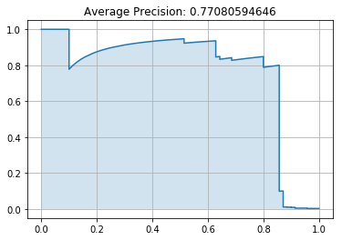
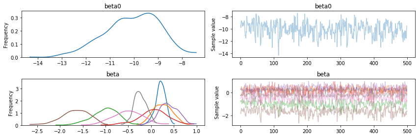
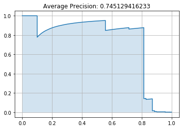
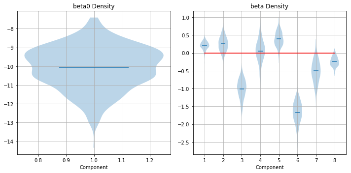

# Credit Card Fraud Detection using Baysian Treatment of a Logistic Regression

## Problem Statement and EDA

In this notebook, I will train a logistic regression to identify fraudulent credit card transactions using a Kaggle dataset composed of data collected from approximately 285000 purchases. You can access the dataset [here](https://www.kaggle.com/dalpozz/creditcardfraud).

This dataset is highly unbalanced, containing only 489 examples of fraud in the entire dataset, which means the evaluating classifiers based on predictive accuracy is essentially meaningless. Instead, we will evaluate classifiers based on their average precision (area under precision-recall curve, or AUPRC), given by

$
    AUPRC = TP / (TP + FP)
$

First, we will import some necessary packages and the dataset.


```python
import matplotlib.pyplot as plt
import numpy as np
import pandas as pd
import pymc3 as pm
```


```python
df = pd.read_csv("creditcard.csv")
```

This dataset contains 30 features generated using PCA.

We want to know which inputs give the best class seperation, which will hopefully reduce the dimensionality of the datset. This just requires a little visualization to determine.


```python
n_rows, n_cols = 5, 6

fig, ax = plt.subplots(n_rows, n_cols, figsize=(15,15))

ax = ax.reshape(-1)
for i, feature in enumerate(df.columns):
    if feature == "Class": continue
    fraud = df.loc[:,feature][df["Class"] == 1].values
    non_fraud = df.loc[:,feature][df["Class"] == 0].values

    ax[i].hist(non_fraud,
             color="blue",
             weights=np.zeros_like(non_fraud) + 1. / non_fraud.size,
             bins=15,
             alpha=0.5)
    ax[i].hist(fraud,
             color="red",
             weights=np.zeros_like(fraud) + 1. / fraud.size,
             bins=8,
             alpha=0.5)
    ax[i].set_title(feature)

plt.tight_layout()
plt.show()
```


Using this, we can select the best features and build the training and testing sets for the classifier.


```python
selected_features = ["V3", "V4", "V10", "V11", "V12", "V14", "V16", "V17"]

N = int(1. * len(df))
idx = np.random.choice(np.arange(len(df)),N)

df = df.iloc[idx,:]
len(df[df["Class"]==1])
t = df.Class.values # targets
X = df.loc[:,selected_features].values # features

idx2 = np.arange(len(t))
train_n = int(.5 * len(idx2))
train_idx = idx2[:train_n]
test_idx = idx2[train_n:]

train_X = X[train_idx,:]
train_t = t[train_idx]

test_X = X[test_idx,:]
test_t = t[test_idx]
```

For comparison, we will perform the classification task using the vanilla model from Scikit-Learn, and a Bayesian model that we will contruct.

### The Vanilla Model

First, the vanilla model. Since the dataset is so highly unbalanced, we will use the average precision of the classifier as a metric.


```python
from sklearn.linear_model import LogisticRegression

lr = LogisticRegression()
lr.fit(y = train_t, X = train_X)

pred_y = lr.predict_proba(test_X)[:,1]
```


```python
from sklearn.metrics import average_precision_score, precision_recall_curve

auprc = average_precision_score(y_true=test_t, y_score=pred_y)
precision, recall, _ = precision_recall_curve(y_true=test_t, probas_pred=pred_y)

plt.plot(recall, precision)
plt.title('Average Precision: ' + str(auprc))
plt.fill_between(recall, precision, alpha=0.2)
plt.grid()
plt.show()
```





### The Bayesian Model

An average precision of 0.74 isn't bad, but it isn't great either. Let's see if we can do better with a Bayesian treatment of the regression problem.

A logistic regression takes the form

$ f(x) = \sigma(\beta^T x + \beta_0 )$

where $\sigma$ is the sigmoid function given by

$ \sigma(x) = \frac{1}{1 + \exp(-x)}$

We want to completely describe the posterior distribution $Pr(\beta, \beta_0 | \{t_i\}, \{x_i\})$, which is given by Bayes theorem as

$
Pr(\beta, \beta_0 | \{t_i\}, \{x_i\}) \propto Pr(\beta, \beta_0) Pr(\{t_i\}, \{x_i\} | \beta, \beta_0)
$

Using MCMC, we can sample from the posterior distribution to estimate the true distribution of $\beta$ and $\beta_0$.


```python
n = train_X.shape[1]

beta_tau = obs_tau = .2

with pm.Model() as model:
    beta0 = pm.Normal("beta0", 0, tau=beta_tau)
    beta = pm.MvNormal("beta", np.zeros(n), tau=beta_tau * np.eye(n), shape=(1,n))

    y = pm.math.sigmoid(pm.math.dot(beta, np.transpose(train_X)) + beta0)

    obs = pm.Normal("obs", 0, obs_tau, observed=train_t-y)

```


```python
with model:
    trace = pm.sample(500)
```

    Auto-assigning NUTS sampler...
    Initializing NUTS using jitter+adapt_diag...
    100%|██████████| 1000/1000 [00:54<00:00, 18.19it/s]


We can plot the trace of the samples given and do a kernel density estimation of each parameter.


```python
pm.traceplot(trace)
plt.show()
```





Using this distribution, we can estimate the parameters of the regression as the mean of the distribution.


```python
def predict(x, beta, beta0):
    yl = np.dot(x, beta) + beta0
    return 1 / (1 + np.exp(-yl))

beta0_pred = trace["beta0"].mean()
beta_pred = trace["beta"].mean(axis=0).squeeze()

y_pred = []
for i in range(test_X.shape[0]):
    y_pred.append(predict(test_X[i,:], beta_pred, beta0_pred))

class_pred = np.round(y_pred)
```

Using these predictions, we can evaluate the classifier in the same way that the vanilla classifier was.


```python
auprc = average_precision_score(y_true=test_t, y_score=y_pred)
precision, recall, _ = precision_recall_curve(y_true=test_t, probas_pred=y_pred)

plt.plot(recall, precision)
plt.title('Average Precision: ' + str(auprc))
plt.fill_between(recall, precision, alpha=0.2)
plt.grid()
plt.show()
```





Another way of visualizing the posterior is using a violin plot of the parameters. This is another way of determining which features are significant for performing the regression, and also gives a semblance of the amount of confidence that exists in each parameter estimation.


```python
beta0_trace = trace.get_values('beta0')
beta_trace = trace.get_values('beta')[:,0,:]

fig, ax = plt.subplots(1,2, figsize=(10,5))

ax[0].violinplot(beta0_trace, showmeans=True, showextrema=False)
ax[0].grid()
ax[0].set_title('beta0 Density')
ax[0].set_xlabel("Component")

ax[1].violinplot(beta_trace, showmeans=True, showextrema=False)
ax[1].grid()
ax[1].set_title('beta Density')
ax[1].plot([x for x in range(1,len(beta_pred)+1)], [0 for x in range(1,len(beta_pred)+1)], color="red")
ax[1].set_xlabel("Component")

plt.tight_layout()
plt.show()

```





Using pymc3's toolbox, we can get a nice summary of this.


```python
print(pm.summary(trace))
```


    beta0:

      Mean             SD               MC Error         95% HPD interval
      -------------------------------------------------------------------

      -10.066          1.136            0.070            [-12.180, -7.861]

      Posterior quantiles:
      2.5            25             50             75             97.5
      |--------------|==============|==============|--------------|

      -12.473        -10.766        -9.954         -9.194         -8.114


    beta:

      Mean             SD               MC Error         95% HPD interval
      -------------------------------------------------------------------
      ..............................[0, :]...............................
      0.205            0.117            0.006            [-0.024, 0.427]
      0.254            0.205            0.011            [-0.097, 0.668]
      -1.008           0.285            0.016            [-1.606, -0.515]
      0.056            0.326            0.018            [-0.669, 0.675]
      0.389            0.213            0.011            [-0.035, 0.775]
      -1.669           0.302            0.018            [-2.255, -1.153]
      -0.504           0.327            0.019            [-1.164, 0.079]
      -0.238           0.137            0.007            [-0.514, 0.018]

      Posterior quantiles:
      2.5            25             50             75             97.5
      |--------------|==============|==============|--------------|
      .............................[0, :].............................
      -0.069         0.143          0.210          0.282          0.404
      -0.130         0.103          0.251          0.403          0.653
      -1.621         -1.182         -0.989         -0.801         -0.525
      -0.665         -0.131         0.063          0.262          0.679
      -0.035         0.239          0.378          0.547          0.775
      -2.339         -1.857         -1.653         -1.440         -1.175
      -1.137         -0.720         -0.500         -0.293         0.148
      -0.504         -0.334         -0.244         -0.142         0.030

    None


We can see that a Baysian treatment of the regression produces a classifier with approximately the same precision, but more importantly gives a better sense of the probability distribution of the parameters of the regression. These distributions can be used to compute more appropriate point estimates of the parameters than classical maximum likelihood fitting used in the vanilla classifier. This treatment also allows for intrinsic control of model complexity regardless of how many parameters the model actually contains.
